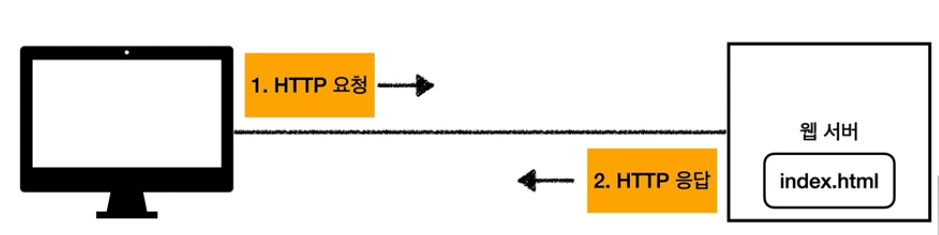

# [웹 애플리케이션 이해]

## 1. 웹 서버, 웹 애플리케이션 서버

### 모든 것이 HTTP

- HTTP 메시지에 모든 것을 전송
- 거의 모든 형태의 데이터 전송 가능
- 서버 간에 데이터를 주고 받을 때도 대부분 HTTP 사용

### 웹 서버(Web Server)

- HTTP 기반으로 동작

- 정적 리소스 제공, 기타 부가기능

- 정적(파일) HTML, CSS, JS, 이미지, 영상

- 예) NGINX, APACHE

  

### 웹 애플리케이션 서버(WAS - Web Application Server)

- HTTP 기반으로 동작
- 웹 서버 기능 포함 + (정적 리소스 제공 가능)
- 프로그램 코드를 실행해서 애플리케이션 로직 수행
  - 동적 HTML, HTTP API(JSON)
  - 서블릿, JSP, 스프링 MVC
- 예) 톰캣(Tomcat), Jetty, Undertow

### 웹 서버, 웹 애플리케이션 서버(WAS) 차이

- **웹 서버는 정적 리소스(파일), WAS는 애플리케이션 로직**
- 사실은 둘의 용어도 경계가 모호함
  - 웹 서버도 프로그램을 실행하는 기능을 포함하기도 함
  - 웹 애플리케이션 서버도 웹 서버의 기능을 제공함
- 자바는 서블릿 컨테이너 기능을 제공하면 WAS
  - 서블릿 없이 자바코드를 실행하는 서버 프레임워크도 있음
- **WAS는 애플리케이션 코드를 실행하는 데에 더 특화**

### 웹 시스템 구성 - WAS, DB

- WAS, DB만으로 시스템 구성 가능
- WAS는 정적 리소스, 애플리케이션 로직 모두 제공 가능

- WAS가 너무 많은 역할을 담당, 서버 과부하 우려
- 가장 비싼 애플리케이션 로직이 정적 리소스 때문에 수행이 어려울 수 있음
- WAS 장애시 오류 화면도 노출 불가능

### 웹 시스템 구성 - WEB, WAS, DB

- 정적 리소스는 웹 서버가 처리

- 웹 서버는 애플리케이션  로직같은 동적인 처리가 필요하면 WAS에 요청을 위임

- WAS는 중요한 애플리케이션 로직 처리 전담

  

- 효율적인 리소스 관리
- 정적 리소스가 많이 사용되면 Web 서버 증설
- 애플리케이션 리소스가 많이 사용되면 WAS 증설
- 정적 리소스만 제공하는 웹 서버는 잘 죽지 않음
- 애플리케이션 로직이 동작하는 WAS 서버는 잘 죽음
- WAS, DB 장애시 WEB 서버가 오류 화면 제공 가능

- API만 주고 받을 때에는 WAS만 있어도 된다

## 2. 서블릿

### 서버에서 처리해야 하는 업무

- 서버 TCP/IP 연결 대기, 소켓 연결
- HTTP 요청 메시지를 파싱해서 읽기
- POST 방식, /save URL 인지
- Content-Type 확인
- HTTP 메시지 바디 내용 파싱
- 저장 프로세스 실행
- 비즈니스 로직 실행
  - DB 저장 요청

- HTTP 응답 메시지 생성 시작
  - HTTP 시작 라인 생성
  - Header 생성
  - 메시지 바디에 HTML 생성하여 입력
- TCP/IP에 응답 전달, 소켓 종료

### 서블릿

- `urlPatterns(/hello)`의 URL이 호출되면 서블릿 코드가 실행
- HTTP 요청 정보를 편리하게 사용할 수 있는 `HttpServletRequest`
- HTTP 응답 정보를 편리하게 제공할 수 있는 `HttpServletResponse`
- 개발자는 HTTP 스펙을 매우 편리하게 사용

#### HTTP 요청, 응답 흐름

- HTTP 요청시
  - WAS는 Request, Response 객체를 새로 만들어서 서블릿 객체 호출
  - 개발자는 Request 객체에서 HTTP 요청 정보를 편리하게 꺼내서 사용
  - 개발자는 Response 객체에서 HTTP 응답 정보를 편리하게 입력
  - WAS는 Response 객체에 담겨있는 내용으로 HTTP 응답 정보를 생성

### 서블릿

- 톰캣처럼 서블릿을 지원하는 WAS를 서블릿 컨테이너라고 함
- 서블릿 컨테이너는 서블릿 객체를 생성, 초기화, 호출, 종료하는 생명주기 관리
- 서블릿 객체는 **싱글톤으로 관리**
  - 고객의 요청이 올 때마다 계속 객체를 생성하는 것은 비효율
  - 최초 로딩 시점에 서블릿 객체를 미리 만들어두고 재활용
  - 모든 고객 요청은 동일한 서블릿 객체 인스턴스에 접근
  - **공유 변수 사용 주의**
  - 서블릿 컨테이너 종료시 함께 종료
- JSP도 서블릿으로 변환되어 사용
- 동시 요청을 위한 멀티 쓰레드 처리 지원

## 3. 동시 요청 - 멀티 쓰레드

### 쓰레드

- 애플리케이션 코드를 하나하나 순차적으로 실행하는 것은 쓰레드
- 자바 메인 메서드를 처음 실행하면 main이라는 이름의 쓰레드가 실행
- 쓰레드가 없다면 자바 애플리케이션 실행이 불가능
- 쓰레드는 한번에 하나의 코드 라인만 수행
- 동시 처리가 필요하면 쓰레드를 추가로 생성

### 요청마다 쓰레드 생성

- 장점
  - 동시 요청을 처리할 수 있다
  - 리소스(CPU, 메모리)가 허용할 때까지 처리가능
  - 하나의 쓰레드가 지연되어도, 나머지 쓰레드는 정상 동작한다
- 단점
  - 쓰레드는 생성 비용이 매우 비싸다	
    - 고객의 요청이 올 때마다 쓰레드를 생성하면, 응답 속도가 늦어진다
  - 쓰레드는 컨텍스트 스위칭 비용이 발생한다
    - CPU 코어 하나가 하나의 쓰레드를 실행하는데 두 개의 쓰레드를 전환할 때 비용이 발생 => context switching cost
  - 쓰레드 생성에 제한이 없다
    - 고객 요청이 너무 많이 오면, CPU, 메모리 임계점을 넘어서 서버가 죽을 수 있다

### 쓰레드 풀

#### 요청마다 쓰레드 생성의 단점 보완

- 특징

  - 필요한 쓰레드를 쓰레드 풀에 보관하고 관리한다
  - 쓰레드 풀에 생성 가능한 쓰레드의 최대치를 관리한다. 톰캣은 최대 200개 기본 설정(변경 가능)

- 사용

  - 쓰레드가 필요하면, 이미 생성되어 있는 쓰레드를 쓰레드 풀에서 꺼내서 사용한다
  - 사용을 종료하면 쓰레드 풀에 해당 쓰레드를 반납한다
  - 최대 쓰레드가 모두 사용 중이어서 쓰레드 풀에 쓰레드가 없으면?
    - 기다리는 요청은 거절하거나 특정 숫자만큼만 대기하도록 설정할 수 있다

- 장점

  - 쓰레드가 미리 생성되어 있으므로, 쓰레드를 생성하고 종료하는 비용(CPU)이 절약되고, 응답 시간이 빠르다

  - 생성 가능한 쓰레드의 최대치가 있으므로 너무 많은 요청이 들어와도 기존 요청은 안전하게 처리할 수 있다

#### 실무 팁

- WAS의 주요 튜닝 포인트는 최대 쓰레드(max thread) 수이다
- 이 값을 너무 낮게 설정하면?
  - 동시 요청이 많으면, 서버 리소스는 여유롭지만, 클라이언트는 금방 응답 지연
- 이 값을 너무 높게 설정하면?
  - 동시 요청이 많으면, CPU, 메모리 리소스 임계점 초과로 서버 다운
- 장애 발생시?
  - 클라우드면 일단 서버부터 늘리고, 이후에 튜닝
  - 클라우드가 아니면 열심히 튜닝

#### 쓰레드 풀의 적정 숫자

- 적정 숫자는 어떻게 찾나요?
- 애플리케이션 로직의 복잡도, CPU, 메모리, IO 리소스 상황에 따라 모두 다름
- 성능 테스트
  - 최대한 실제 서비스와 유사하게 성능 테스트 시도
  - 툴 : 아파치 ab, JMeter, nGrinder

### WAS의 멀티 쓰레드 지원

- 멀티 쓰레드에 대한 부분은 WAS가 처리
- **개발자가 멀티 쓰레드 관련 코드를 신경쓰지 않아도 됨**
- 개발자는 마치 **싱글 쓰레드 프로그래밍을 하듯이 편리하게 소스 코드를 개발**
- 멀티 쓰레드 환경이므로 싱글톤 객체(서블릿, 스프링 빈)는 주의해서 사용

## 4. HTML, HTTP API, CSR, SSR

1. 정적 리소스
2. 동적 HTML 페이지
3. HTTP API 

## 5. 자바 백엔드 웹 기술 역사

#### 과거 기술

- 서블릿 - 1997
  - HTML 생성이 어려움
- JSP - 1999
  - HTML 생성은 편리하지만, 비즈니스 로직까지 너무 많은 역할 담당

- 서블릿, JSP 조합 MVC 패턴 사용
  - 모델, 뷰, 컨트롤러로 역할을 나누어 개발
- MVC 프레임워크 춘추 전국 시대 - 2000년 초 ~ 2010년 초
  - MVC 패턴 자동화, 복잡한 웹 기술을 편리하게 사용할 수 있는 다양한 기능 지원
  - 스트럿츠, 웹워크, 스프링 MVC(과거 버전)

#### 현재 사용 기술

- 애노테이션 기반의 스프링 MVC 등장
  - `@Controller`
  - MVC 프레임워크의 춘추 전국 시대 마무리
- 스프링 부트의 등장
  - 스프링 부트는 서버를 내장
  - 과거에는 서버에 WAS를 직접 설치하고, 소스는 War 파일을 만들어서 설치한 WAS에 배포
  - 스프링 부트는 빌드 결과(Jar)에 WAS 서버 포함 -> 빌드 배포 단순화

#### 최신 기술 - 스프링 웹 기술의 분화

- Web Servlet - Spring MVC
- Web Reactive - Spring WebFlux

#### 최신 기술 - 스프링 웹 플럭스

- 특징
  - 비동기 넌블로킹 처리
  - 최소 쓰레드로 최대 성능 - 쓰레드 컨텍스트 스위칭 비용 효율화
  - 함수형 스타일로 개발 - 동시처리 코드 효율화
  - 서블릿 기술 사용X => netty 사용
- But
  - 웹 플럭스는 기술적 난이도 매우 높음
  - 아직은 RDB 지원 부족
  - 일반 MVC의 쓰레드 모델도 충분히 빠르다
  - 실무에서 아직 많이 사용하지는 않음

### 자바 뷰 템플릿 역사

- JSP
  - 속도 느림, 기능 부족
- Freemarker, Velocity
  - 속도 문제 해결, 다양한 기능
- Thymeleaf
  - 내추럴 템플릿 : HTML의 모양을 유지하면서 뷰 템플릿 적용 가능
  - 스프링 MVC와 강력한 기능 통합
  - **최선의 선택**, 단 성능은 Freemarker, Velocity가 더 빠름

